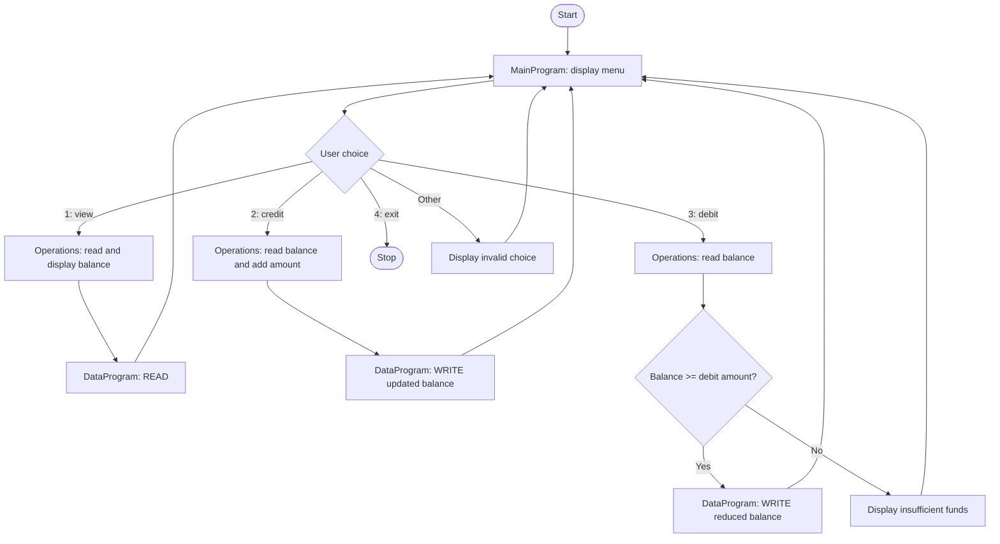

# Student Account Management System

This COBOL sample is a console-based account management program. It demonstrates viewing a balance and applying credits or debits through separately callable programs. Despite the student-account context, the current implementation stores one shared balance and does not maintain student names, IDs, or separate accounts.

## COBOL programs

### `src/cobol/main.cob` - `MainProgram`

Displays the account menu, reads the user's selection, and dispatches requests to `Operations`:

- `1`: view the current balance (`TOTAL `)
- `2`: credit the account (`CREDIT`)
- `3`: debit the account (`DEBIT `)
- `4`: exit the program

Any other menu selection displays an invalid-choice message.

### `src/cobol/operations.cob` - `Operations`

Implements the account actions and prompts for transaction amounts.

- `TOTAL ` reads and displays the current balance.
- `CREDIT` reads the balance, adds the entered amount, saves the result, and displays it.
- `DEBIT ` reads the balance and subtracts the entered amount only when the balance is at least that amount. Otherwise, it displays an insufficient-funds message and leaves the balance unchanged.

### `src/cobol/data.cob` - `DataProgram`

Provides the balance storage interface used by `Operations`. The `READ` operation copies the stored balance to the caller; `WRITE` replaces the stored balance with the caller's value. The initial balance is `1000.00`.

## Program flow

## Account rules and behavior

- The balance starts at `1000.00` and is represented with two decimal places.
- Credits increase the balance by the entered amount.
- Debits are allowed when the balance is greater than or equal to the requested amount. A debit cannot make the balance negative.
- A rejected debit does not update the stored balance.
- The data program holds a single balance; there is no student-level account selection or transaction history.
- The program does not explicitly validate that transaction amounts are positive or within the balance field's capacity. It also does not persist the balance to a file or database, so the initial value is restored when the program starts again.
